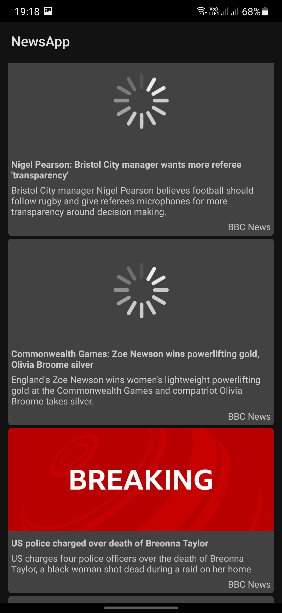
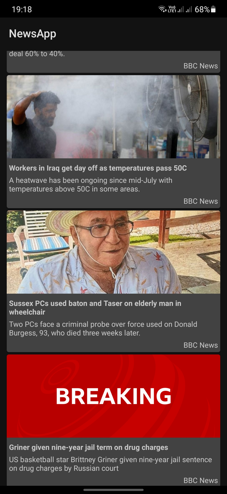
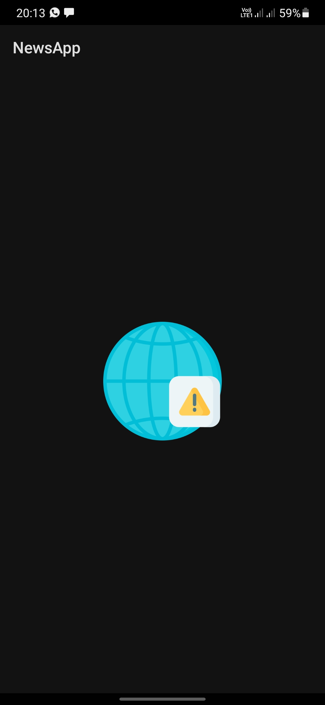

<p align="center">

</p>
<p align="center">


</p>

## NewsApp


A minimalistic news app built with MVVM architecture that consumes newsapi.org rest api

Min Api Level: 21 [Android 5.0](https://developer.android.com/studio/releases/platforms)

Build System : [Gradle](https://gradle.org/)

## Screenshots

|  |  |  |
|---|---|---|

## Setup Guide
After cloning the repo:

1. Register at [newsapi.org](https://newsapi.org) to get an api key.
2. Add the api key to `local.properties` file.
```
apiKey="YOUR_API_KEY"
```
3. Build and install the app.

<b>Disclaimer: </b>If you encounter any problems while adding the api key, use this [reference](https://gist.github.com/loftywaif002/f2ebe2024ad73d6a579285dcba250465).

## Libraries

- [Retrofit2](https://square.github.io/retrofit/) : A type-safe HTTP client for Android and Java.
- [Moshi](https://github.com/square/moshi) : A modern JSON library for Android, Java and Kotlin. It makes it easy to parse JSON into Java and Kotlin classes.
- [Glide](https://github.com/bumptech/glide) : A fast and efficient open source media management and image loading framework.
- [Lifecycle-livedata-ktx](https://androidx.tech/artifacts/lifecycle/lifecycle-livedata-ktx/) : Kotlin extensions for 'livedata' artifact.
